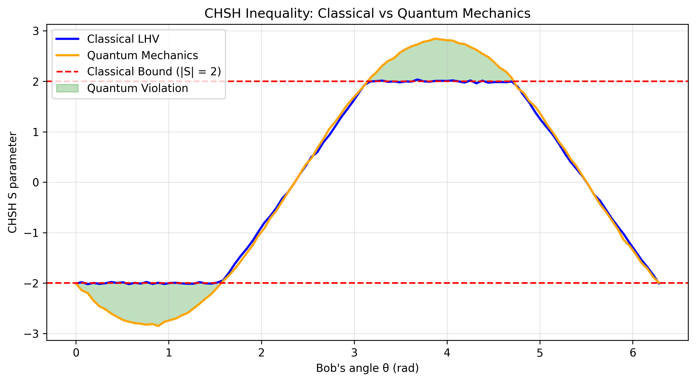

# Bell Inequality Simulations

Classical and quantum simulations of CHSH Bell inequalities using local hidden-variable (LHV) models and Qiskit.

> **Note:** Personal learning project — First GitHub repository.

---

## Overview

This project explores the **Clauser-Horne-Shimony-Holt (CHSH)** version of Bell inequalities through computational physics simulations. 

It compares deterministic local realism against quantum entanglement ($\vert{}\Psi^-\rangle$ singlet state), demonstrating how quantum mechanics violates the classical bound of $\vert{}S\vert{} \leq 2$.

### Visual Results


*1D sweep comparing classical local realistic bounds ($\vert{}S\vert{} \leq 2$) against quantum mechanics correlations ($\vert{}S\vert{} \leq 2\sqrt{2}$) as a function of Bob's measurement angle.*

---

## Key Features

- **Classical LHV Models:** Numerical simulations based on local hidden variables.
- **Quantum Circuit Simulations:** Executed using Qiskit's `AerSimulator`.
- **Parametric Visualizations:** 
  - 1D angle sweeps showing classical vs. quantum $S$ values.
  - 2D heatmaps mapping the full joint angle space $S(a, b)$.

---

## Project Structure

```text
bell-inequality-simulations/
├── results/                   # Auto-generated high-resolution plots
│   ├── chsh_1d_comparison.png
│   └── chsh_2d_heatmaps.png
├── src/
│   ├── chsh_plots.py          # Main plotting functions
│   ├── classical_models.py    # LHV Monte Carlo models
│   ├── quantum_model.py       # Qiskit circuit routines
│   └── run_chsh.py            # Main runner functions
├── requirements.txt           # Environment dependencies
└── README.md                  # Documentation
```

##  Purpose

This repository is a learning project focused on:

- Git/GitHub workflow  
- scientific Python project structure  
- computational physics  
- quantum information theory  
